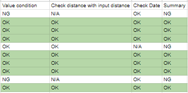

# 🏃‍♀️ **Sports Day Reinvented**
## AI‑Powered Running Score Tracking (Google Cloud Vision)

**Why this exists**  
Sports Day results come as **photos** — scoreboards and watch/treadmill screens. Typing them into a sheet is slow and easy to get wrong. We use **Google Cloud Vision** to read the text, simple rules to pick out **time** and **distance**, and send the results to **Google Sheets** each day. Every number can be checked with its original photo. Read the main story for what we did; details and code are at the end. 

---

## Agenda
  1. Project Overview 
  2. Event Context & Submitted data
  3. Prepare Tech Stack
  4. End‑to‑End Pipeline (Simplified)
  5. Future Improvement
  6. Authur

---

## 1) Project Overview 
**- Problem -**  
In Sports Day’s running events, participants record their own results and submit a captured image via Google Form so the judges can aggregate and analyze the results. However, there are about **700 participants**, and the competition runs **every day for one week**. New images keep coming in across all 7 days, creating a huge volume to review. Doing this purely by people may be overwhelming and can lead to mistakes.

**- Solution -**  
We looked for a way to reduce judges’ manual work, improve accuracy, and cut human error caused by the massive workload. We use **Google Cloud Vision** to detect text in images and turn it into the **distance** and **running time**. These values are then checked against the distance entered by the submitter to verify whether it’s truly correct.

**- Impact !! -**  
- This significantly reduces the commitee workload
- Enables **daily result announcements**
- Makes the competition more engaging because each day’s results are available quickly.

---

## 2) Event Context & Submitted data
We process three photo contexts:
- **Scoreboards** (handwritten/printed)  
- **Smartwatch screens** (Garmin/Apple/Android; Outdoor duration & distance)
- **Treadmill machine panels** (Indoor distance/time/pace)

  

**Collection Flow**
- Participants submit via **Google Forms** --> Photos are saved to **Google Drive**, and responses data to **Google Sheets**.

  

**Response Schema**
- เลือกทีมของตัวเอง (Select your team)
- รหัสพนักงาน (Employee ID)
- ระยะทาง หน่วยกิโลเมตร  (Distance in km unit)
- ลักษณะสถานที่วิ่ง (Where did you run?)
- รูปถ่ายแสดงระยะทาง Outdoor และเวลาจากอุปกรณ์สมาร์ทวอทช์ หรือแอปพลิเคชันจากมือถือ  (Photo showing distance and time from a smartwatch or mobile application)
- รูปถ่ายตัวเองระหว่างร่วมกิจกรรมแบบ Outdoor (Selfie)
- รูปถ่ายแสดงระยะทาง Indoor และเวลาจากอุปกรณ์สมาร์ทวอทช์ หรือแอปพลิเคชันจากมือถือ  (Photo showing distance and time from a smartwatch or mobile application)
- รูปถ่ายระยะทางจากเครื่องออกกำลังกาย (Photo of the distance display from the exercise machine.)
- รูปถ่ายตัวเองระหว่างร่วมกิจกรรมแบบ Indoor (Selfie)

---

## 3) Prepare Tech Stack
1. **Account**: Google Account - For using google resources
    * Create Google account
2. **Storage**: Google Drive (form uploads) - For keep data such as Forms, Sheet, Photos
    * have automatically with google account
3. **Data**: Google Sheets - For keep response data from participants
    * can use automatically because google account
4. **Intake (Form UI)**: Google Forms - For creating the questionaire to participants
    * Creater Google Forms 
    * Use response schema in 2nd topic to create question
    * ( Google forms will place in your google drive)
    * Link response with Google sheet 
      - Click "Response"
      - Click "View in Sheets"

        

      - tab "Select destination for response" --> Select "Create a new spreadsheet"
      - Click "Create"
    * Click "View in Sheets" --> You will go to sheet that have response from participants

        

5. **Cloud**: Google cloud platform - For using google cloud resources
    * Search and Click "Google cloud console" web
    * Click "Get started for free" --> Fill information --> Click "Agree & continue"
    * Add credit card **"Important"** (If want to use service following this project, have to add credit card, but this project don't have cost because It is in free tier condition of google could)
    
        
        
    * Click Hamburgur button( Navigation Menu. )
    * Click "IAM & Admin"
    * Manage Resources
    * Click "create project"
    * Fill information
      - Project name : **OCR_Running**
      - Location : No organization
6. **Runtime**: (Cloud Run / Cloud Functions or local) - For run logic operation for text detection system.
    * Search in Cloud console "Cloud run functions"
    * Click "Cloud run functions"
    * Click "Enable"
    * Click at button that near with "Google cloud" 
    * Select project : **OCR_Running**
7. **AI**: Google Cloud Vision API (Text Detection) - For using AI to help detecting texts in photos
    * Search in Cloud console "Cloud Vision API"
    * Click "Cloud Vision API"
    * Click "Enable"
8. **Automation**: Cloud Scheduler (triggers worker) - For run logic operation automatically, Example logic runs every 30 minutes --> Text detection every 30 minutes. 
    * Search in Cloud console "Cloud Scheduler"
    * Click "Cloud Scheduler"
    * Click "Enable"
9. **Auth**: Service Account (Sheets + Drive scopes) - For create authority for working on cloud and use resouces securely.
    * Click Hamburgur button( Navigation Menu. )
    * Click "IAM & Admin"
    * Click "Service Accounts"

        

    * Click "+ Create service account"
      1. 1st service account : forms-ocr-sa (For create authority to access google sheet and drive & use Cloud vision AI)
        - Fill information
            1. Create service account
              * Service account name : forms-ocr-sa
              * Service account ID : forms-ocr-sa
                Click "Continue"
            2. Permissions(Optional)
              * Serect a role : Quick access "Basic", Roles "Editor"
              Click "Continue"
            3. Principals with access (optional) "No important"
              Click "Done"
            4. Get Service Account : forms-ocr-sa@......iam.gserviceaccount.com ( It will show on "IAM&Admin > Service Accounts" page )
      2. 2nd service account : scheduler-invoker (For create authority to control scheduler service)
        - Fill information
            1. Create service account
              * Service account name : scheduler-invoker
              * Service account ID : scheduler-invoker
                Click "Continue"
            2. Permissions(Optional)
              * Serect a role : Quick access "Basic", Roles "Editor"
              Click "Continue"
            3. Principals with access (optional) "No important"
              Click "Done"
            4. Get Service Account : scheduler-invoker@......iam.gserviceaccount.com ( It will show on "IAM&Admin > Service Accounts" page )
    * Give permission for access drives that keep photos and sheet (let script operation can work with data in drive)
      1. Go to your Google Drive
      2. Find the folder that keep photo and response that participants submitted.
      3. Click "Hamburger button"
      4. Click "Share" and Click "Share"
      5. "Add people,groups,..." panel : fill your service account **"forms-ocr-sa@......iam.gserviceaccount.com"** ( It will show on "IAM&Admin > Service Accounts" page )
      6. Select : Editor
      7. Click "Send"

        

---

## 4) End‑to‑End Pipeline (Simplified)

### 4.1 OCR operation
- A python script - **ocr_sheet.py** on **Cloud run** calls the **Cloud Vision API** for text detection ( all on **Google Cloud** ).
- Detection results are written to a new column in the worksheet, and validation logic checks the values.

  

  How to use?
  1. Edit the **sheet_id** in the script.
    - SPREADSHEET_ID   = os.getenv("SPREADSHEET_ID", **"....INPUT YOUR SHEET-ID...."**)

      How to find sheet-id?
      Go to your sheet and copy your sheet id following the below picture.

      

  2. Create a function **ocr_sheet** at cloud run functions service on Google cloud platform.
      1. Search "cloud run functions"
      2. Click "Write a function"
      3. Fill information to create
          - Choice : Use an lnline editor to create a function
          - Service name : ocr-sheet
          - Region : asia-southeast1 (Singapore)
          - Runtime : Python 3.13
          - Authentication : Require authentication
          - Containers, Volumes, Networking, Security --> Security
              - Service account : forms-ocr-sa (that have been created at Topic 3.Auth)
      4. Create

          

      5. Click "ocr_sheet" function that be created.
      6. Click "Source".
      7. Click "Edit source".
      8. Copy code "ocr_sheet.py" in git to main.py in ocr_sheet function.
      9. Copy code "requirements_ocr_sheet.txt" in git to requirements.txt in ocr_sheet function.
      10. Function entry point : ocr_sheet
      11. Click "Save and redeploy"
  
          

  3. Run function
      1. Click "Test"
      2. Click "Test in Cloud Shell"
          - It will open the cloud terminal and have command existed.
          - Type "Enter" 
          - Finish --> see the result at your google sheet.

          

### 4.2 Summary result
- Summary data(yesterday data) to daily form and merge the distance and duration columns for indoor and outdoor runs using script - **summary_daily.py** 
- **Let the committee review and validate the data --> Finish !!**

  

  How to use?

  1. Edit the **sheet_id** in the script.
      - SPREADSHEET_ID   = os.getenv("SPREADSHEET_ID", **"....INPUT YOUR SHEET-ID...."**)

      ** Same method with step "Edit the **sheet_id**" of OCR operation.

  2. Create a function **summary_daily_record** at cloud run functions service on Google cloud platform.

      ** Same method with step "Create a function **ocr_sheet**" of OCR operation.
      Different points are
      1. Copy code "summary_daily_record.py" in git to main.py in ocr_sheet function.
      2. Copy code "requirements_summary_daily_record.txt" in git to requirements.txt in ocr_sheet function.
      3. Function entry point : summarize_day

  3. Run function
    ** Same method with step "Run function" of OCR operation.

  4. Manual using
    Since this script have operation "Summarized data(yesterday data) to daily form", Thus if we want to summarize today data, we should run this script tomorrow.

### 4.3 Automation process
- For run logic operation automatically, Example logic runs every 30 minutes --> Text detection every 30 minutes.

1. Create 1st schedule : Run "ocr-sheet" function automatically to get detect result every 30 minutes
    * Click "Create job"
    * Define the schedule
        - Name : forms-ocr-job
        - Region : asia-southeast1 (Singapore)
        - Frequency : */30 * * * *  ( --> It means every 30 minutes )
        - Timezone : Indochina Time (ICT) UTC+7 (Bangkok)
        - Click "Continue"

    * Configure the execution
        - Target tipe : HTTP
        - URL : Using url of ocr-sheet function (you can get by going to cloud run function and click into **ocr-sheet**, you can see the links following below picture)

            

        - HTTP method : POST
        - Auth heafer : Add OIDC token
        - Service account : Scheduler-invoker
        - Audience : **"same URL with Above URL"**

    * Configuration optional settings (No need to edit)
    * Click "Create"
2. Create 2nd schedule : Run "summary-daily-record" function automatically to summary result(yesterday data) on 02:00:00 AM
    * Click "Create job"
    * Define the schedule
        - Name : summary-result-job
        - Region : asia-southeast1 (Singapore)
        - Frequency : 0 2 * * *( --> It means every day at 02:00:00 AM )
        - Timezone : Indochina Time (ICT) UTC+7 (Bangkok)
        Click "Continue"
    * Configure the execution
        - Target tipe : HTTP
        - URL : Using url of summary_daily_record function (you can get by going to cloud run function and click into **summary_daily_record**, **same method with 1st schedule
        - HTTP method : POST
        - Auth heafer : Add OIDC token
        - Service account : Scheduler-invoker
        - Audience : **"same URL with Above URL"**
    * Configuration optional settings (No need to edit)
    * Click "Create"
3. Give permission to schedule job that was created at functions 
    * Expect Result : These function can trigger by scheduler
      - Go to **"Cloud run function"**
      - Click select box in front of function **"ocr-sheet" and "summary-daily-record"** 
      - Click "Permissions"
      - Click "Add principal"
      - New principals : scheduler-invoker@......iam.gserviceaccount.com ( You can copy it from "Navigation menu > IAM&Admin > Service Accounts" page )
      - Role : Cloud Run Invoker

### - Script logic and detail -  
### 4.4 Script Behavior (`ocr_sheet.py`)
**1. Result**
1. Distance at **column "Out_Distance_km"**
2. Duration at **column "Out_Duration_hms"**
3. Date on running record photos **column "Shot_Date"**

**2. Running validation**
- Distance need at least 2.00 km --> If not in condition **Column "Out_Status" = Distance Insufficient**
- Duration need not over 02:00:00 Hour --> If not in condition **Column "Out_Status" = Time Over**
- if Distance and Duration aren't in condition **Column "Out_Status" = All Cindition Insufficient**

**3. Outdoor validation**
- For person that runs at outdoor **("ลักษณะสถานที่วิ่ง (Where did you run?)" = กลางแจ้ง/นอกบ้าน (Outdoor))** script will check photo both of running result 

  - at **1st column** "รูปถ่ายแสดงระยะทาง Outdoor และเวลาจากอุปกรณ์สมาร์ทวอทช์ หรือแอปพลิเคชันจากมือถือ  (Photo showing distance and time from a smartwatch or mobile application)"

  - and **2nd column** "รูปถ่ายตัวเองระหว่างร่วมกิจกรรมแบบ Outdoor (Selfie)"
- When It found **Distance and Duration** at **1st column** --> **Column "Out_Status" =  OK**
- If It not found at **1st column**, It will continue checking at **2nd column**, and If it found **Distance and Duration** --> **Column "Out_Status" =  Miss Box**
- If not found Distance and Duration --> **Column "Out_Status" =  NG**

**4. Indoor validation**
- For person that runs at indoor **("ลักษณะสถานที่วิ่ง (Where did you run?)" = ในร่ม (Indoor))** 
    - Script will check **Distance** at **1st column** "รูปถ่ายระยะทางจากเครื่องออกกำลังกาย (Photo of the distance display from the exercise machine.)"
    - Script will check **Duration** at **both of 2nd column** "รูปถ่ายแสดงระยะทาง Indoor และเวลาจากอุปกรณ์สมาร์ทวอทช์ หรือแอปพลิเคชันจากมือถือ  (Photo showing distance and time from a smartwatch or mobile application)" and 1st column "รูปถ่ายระยะทางจากเครื่องออกกำลังกาย (Photo of the distance display from the exercise machine.)" 
- If It found **Duration** at both of 1st column and 2nd column --> Choose minimum duration for answer
- If It not found **Distance and Duration** --> **Column "In_Status" =  OK**
- If It not found **Distance and Duration** --> **Column "In_Status" =  NG**

  

### 4.5 Script Behavior (`summary_daily.py`)
**Result**
1. Column **"Distance"** : Value from merging between Distance of Outdoor and Indoor.
2. Column **"Duration"** : Value from merging between Duration of Outdoor and Indoor.
3. Column **"Value condition"** : Value from merging between "Out_Status" and "In_Status" of Outdoor and Indoor.
4. Column **"Check distance** : with input distance" : If it equal --> "OK", not equal --> "Different" , not have to compare --> "N/A"
5. Column **"Check Date"** : If it equal --> "OK", not equal --> "Different" , not have to compare --> "N/A"
6. Column **"Summary"** : if column "Value condition" = OK, "Check distance with input distance" = OK and "Check Date" = OK --> answer "OK", if not answer "NG"

    

---

## 5) Future Improvement : If you want to improve parser logic
1. Improve detecting "Distance" --> can improve at block **"Smart parsers"**
2. Improve detecting "Duration" --> can improve at block **"Smart parsers"**
3. Improve detecting "Date" --> can improve at block **Smart Date Parser (returns M/D/YYYY)"**
4. Improve model OCR --> This project use pre-train form google, You can improve it better. Good luck!! 

---

## 6) Authur

- Photsawat B.
- Company Email : photsawat.buan@kkpfg.com

- Personal Email : photsawat.phu@gmail.com
- Linkedin : Photsawat Buanuam
- IG : pht_7oi_i

